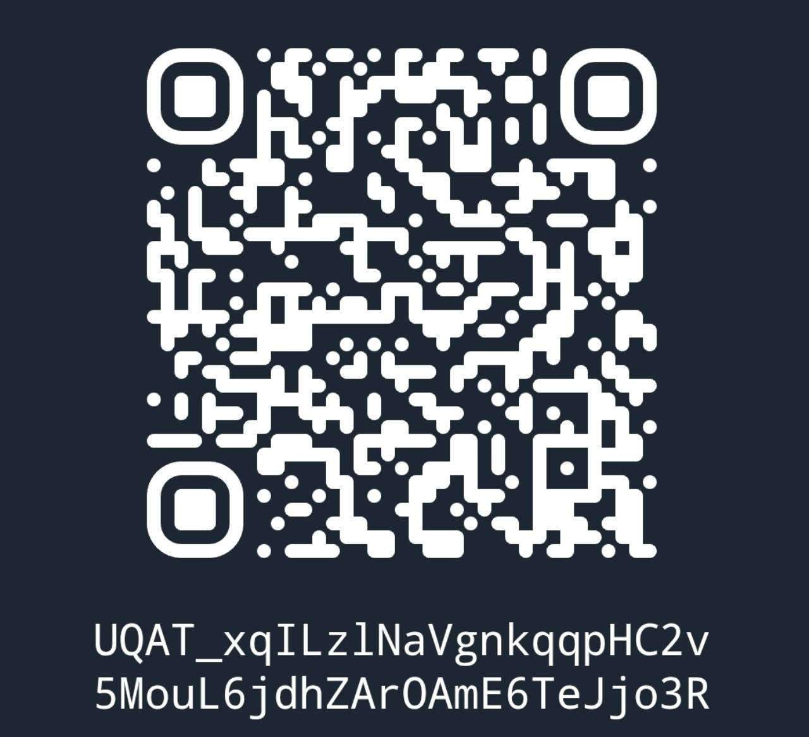
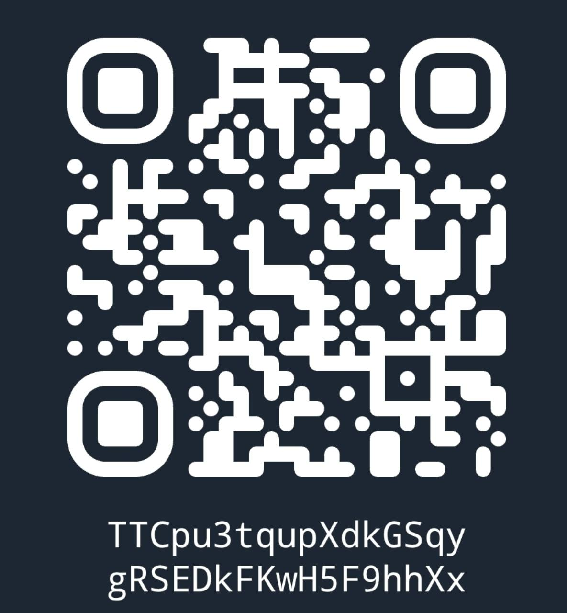

# Добровольная поддержка / Optional support

Если публикация и заметки оказались полезны, можно добровольно поддержать работу Kaktusoff. Это благодарность за уже выполненную работу по обслуживанию и документации, без оплаты доступа, обещания новых функций или приоритетной поддержки.

Прошивка OpenWrt создана проектом OpenWrt и его участниками. Пожертвование по указанным здесь реквизитам получает Kaktusoff, а не проект OpenWrt.

Downloads and documentation are free. These optional donations support Kaktusoff's maintenance and documentation work; they are not payments to the OpenWrt project and do not purchase features or priority support.

## TON

Сеть / Network: **TON**.

```text
UQAT_xqILzlNaVgnkqqpHC2v5MouL6jdhZArOAmE6TeJjo3R
```



## TRON

Сеть / Network: **TRON**. Адрес не определяет конкретный токен; перед отправкой убедитесь в поддержке выбранного актива кошельком получателя.

```text
TTCpu3tqupXdkGSqygRSEDkFKwH5F9hhXx
```



## СБП / Bank transfer

[Открыть предоставленную получателем ссылку СБП](https://t.tb.ru/c2c-qr-choose-bank?requisiteNumber=+79231732233&bankCode=100000000004)

Перед подтверждением перевода проверьте имя получателя в банковском приложении. Ссылка и QR содержат номер телефона получателя.


